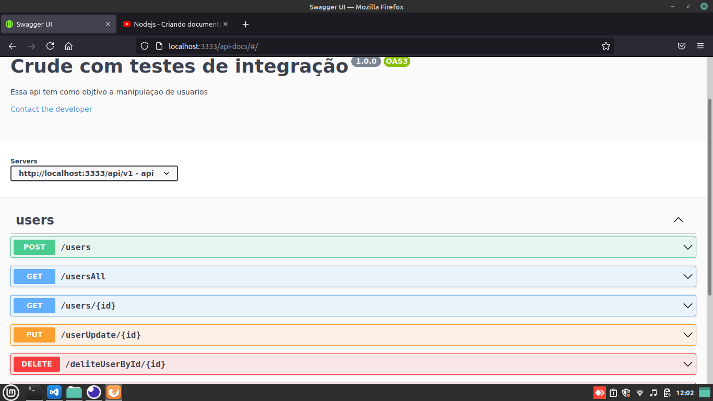

# Crude em jsom 
## O projeto tem 

* Tratativas de erros delicinha <3.
* Testes de integração  
*  Códigos pouco acoplado.
* Documentação utilizando o swagger
* Alguns conceitos dos principios SOLID 
 
## Primeiros passsos
* No seu diretório  que deseja  ter a aplicaçao digite o comando git clone https://github.com/alan-10/teste-FullstackJSjunior.git
* Intalar as dependências com o comando yarn install ou npm install
* Prontinho agora para startar a aplicação digite o comando yarn start 

* utilize o link para abrir a documentação no swagger http://localhost:3333/api-docs/

